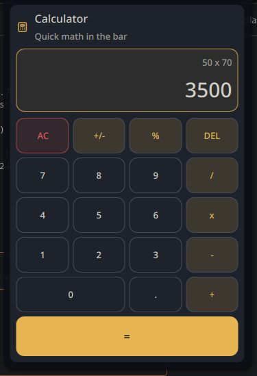

# noctalia-calculator

A theme-aware calculator plugin for Noctalia on Niri, with a bar widget, floating panel, keyboard support, and a clean UI that follows the active shell colors.

## Preview



## Features

- Full expression evaluation with operator precedence via bundled `AdvancedMath.js`
- Bar widget with optional live result badge
- Floating panel with 21-button grid
- Mouse and keyboard input
- Theme-aware colors and spacing
- 10-language i18n (en, pt, es, fr, de, it, ru, zh, ja, ko)
- Configurable decimal precision (0-10)

## Usage

- Left click the bar widget to open the calculator
- Right click the bar widget for the context menu
- Keyboard:
  - `0-9` for digits
  - `+ - * /` for operators
  - `.` or `,` for decimal input
  - `Enter` for equals
  - `Backspace` for delete
  - `Esc` or `Delete` for clear
  - `F9` for sign toggle
  - `%` for percent

## Tests

93 integration tests covering all calculator functions with bundled `AdvancedMath.js`.

| Category | Tests | Description |
|----------|------:|-------------|
| Basic Arithmetic | 6 | `+`, `-`, `*`, `/`, chained operations |
| Decimal Arithmetic | 3 | Floating point handling, precision |
| Sign Toggle | 3 | Positive/negative switching |
| Percent | 2 | Percent conversion |
| Clear & Delete | 6 | Backspace, full clear, state reset |
| Operator Chaining | 2 | Precedence, operator replacement |
| Chained Evaluation | 2 | Reuse result in next calculation |
| Edge Cases | 8 | Division by zero, max input length, error recovery |
| _sanitizeCurrentInput | 4 | Empty, dash, trailing dot, normal |
| _numberToString | 6 | Zero, negative zero, Infinity, NaN, precision |
| compactDisplay | 3 | Short text, exponential, empty |
| _formatExpression | 2 | Token formatting, `*` to `x` |
| expressionPreview | 2 | During input, after evaluation |
| AdvancedMath.evaluate | 22 | sin, cos, tan, sqrt, cbrt, abs, floor, ceil, round, trunc, exp, ln, log, pow, min, max, invalid input |
| displayText & badgeText | 3 | Normal, after eval, error state |
| Full Workflow | 5 | Multi-step chained calculations |
| pressButton Routing | 4 | Action dispatch for all button types |

Run tests:

```bash
node tests/calculator_test.mjs
```

## Files

- `AdvancedMath.js`: math evaluation library (from noctalia-shell Helpers)
- `Main.qml`: calculator logic
- `BarWidget.qml`: bar widget entry point
- `Panel.qml`: floating calculator panel
- `Settings.qml`: plugin settings UI
- `i18n/`: translations (en, pt, es, fr, de, it, ru, zh, ja, ko)

## Author

Pir0c0pter0
`pir0c0pter0000@gmail.com`
